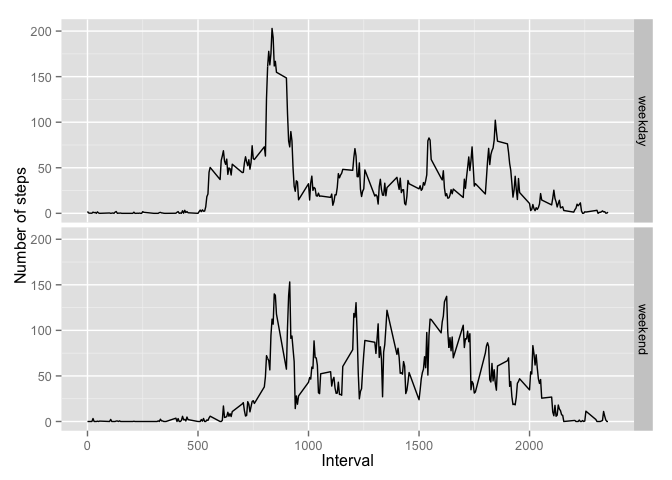

# Assignment: Course Project 1

## Loading and preprocessing the data

### Downloading the dataset


```r
compressedDatasetFileName <- 'dataset.zip'
if (!file.exists(compressedDatasetFileName)) {
  url <- 'https://d396qusza40orc.cloudfront.net/repdata%2Fdata%2Factivity.zip'
  download.file(url, method = 'curl', destfile = compressedDatasetFileName)
}
```

### Extract dataset from zip archive


```r
extractedDatasetFileName <- 'activity.csv'
if (!file.exists(extractedDatasetFileName)) {
  unzip(extractedDatasetFileName)
}
```

### load dataset from file


```r
dataset <- read.csv(extractedDatasetFileName)
```

## What is mean total number of steps taken per day?

### Calculate the total number of steps taken per day


```r
library(dplyr)
```

```
## 
## Attaching package: 'dplyr'
## 
## The following objects are masked from 'package:stats':
## 
##     filter, lag
## 
## The following objects are masked from 'package:base':
## 
##     intersect, setdiff, setequal, union
```

```r
stepsPerDay <- select(dataset, steps, date) %>% group_by(date) %>% summarise(steps = sum(steps))
head(stepsPerDay)
```

```
## Source: local data frame [6 x 2]
## 
##         date steps
##       (fctr) (int)
## 1 2012-10-01    NA
## 2 2012-10-02   126
## 3 2012-10-03 11352
## 4 2012-10-04 12116
## 5 2012-10-05 13294
## 6 2012-10-06 15420
```

### Make a histogram of the total number of steps taken each day


```r
library(ggplot2)
stepsPerDay <- select(dataset, steps, date) %>% group_by(date) %>% summarise(steps = sum(steps, na.rm=TRUE))
ggplot(stepsPerDay, aes(steps)) + geom_histogram()
```

```
## stat_bin: binwidth defaulted to range/30. Use 'binwidth = x' to adjust this.
```

 

### Calculate and report the mean and median of the total number of steps taken per day


```r
meanStepsPerDay <- mean(stepsPerDay$steps, na.rm = TRUE)
paste('mean of the total number of steps taken per day is', meanStepsPerDay)
```

```
## [1] "mean of the total number of steps taken per day is 9354.22950819672"
```

```r
medianStepsPerDay <- median(stepsPerDay$steps, na.rm = TRUE)
paste('median of the total number of steps taken per day is', medianStepsPerDay)
```

```
## [1] "median of the total number of steps taken per day is 10395"
```

## What is the average daily activity pattern?

### Make a time series plot


```r
stepsPerInterval <- select(dataset, steps, interval) %>% group_by(interval) %>% summarise(steps = mean(steps, na.rm=TRUE))
head(stepsPerInterval)
```

```
## Source: local data frame [6 x 2]
## 
##   interval     steps
##      (int)     (dbl)
## 1        0 1.7169811
## 2        5 0.3396226
## 3       10 0.1320755
## 4       15 0.1509434
## 5       20 0.0754717
## 6       25 2.0943396
```

```r
plot(stepsPerInterval$interval, stepsPerInterval$steps, type='l', main = 'Average daily activity pattern', xlab = 'Interval', ylab = 'Average steps')
```

 

### Which 5-minute interval, on average across all the days in the dataset, contains the maximum number of steps?

```r
maxNumberOfSteps <- stepsPerInterval[stepsPerInterval$steps == max(stepsPerInterval$steps),]
paste('The interval that contains the maximum number of steps is', maxNumberOfSteps$interval, 'and contains', maxNumberOfSteps$steps, 'steps')
```

```
## [1] "The interval that contains the maximum number of steps is 835 and contains 206.169811320755 steps"
```

## Imputing missing values

### Calculate and report the total number of in the dataset

```r
paste('there are missing values', nrow(filter(dataset, is.na(steps))))
```

```
## [1] "there are missing values 2304"
```

### Devise a strategy for filling in all of the missing values in the dataset

I'm going to apply the mean of the day and replace the NA with it. If no value for the day and result is NaN the mean is replaced by 0.

### Create a new dataset that is equal to the original dataset but with the missing data filled in

```r
newDataset = dataset[,]
datesWithNa <- newDataset %>% filter(is.na(steps)) %>% select(date) %>% unique()

for (date in datesWithNa$date) {
  dateMean <- mean(newDataset[newDataset$date == date, "steps"], na.rm = TRUE)
  if (is.nan(dateMean)) {
    dateMean <- 0
  }
  newDataset[newDataset$date == date & is.na(newDataset$steps), "steps"] <- dateMean
}
```

### Make a histogram of the total number of steps taken each day


```r
stepsPerDay <- select(newDataset, steps, date) %>% group_by(date) %>% summarise(steps = sum(steps, na.rm=TRUE))
ggplot(stepsPerDay, aes(steps)) + geom_histogram()
```

```
## stat_bin: binwidth defaulted to range/30. Use 'binwidth = x' to adjust this.
```

 


```r
meanStepsPerDay <- mean(stepsPerDay$steps, na.rm = TRUE)
paste('mean of the total number of steps taken per day is', meanStepsPerDay)
```

```
## [1] "mean of the total number of steps taken per day is 9354.22950819672"
```

```r
medianStepsPerDay <- median(stepsPerDay$steps, na.rm = TRUE)
paste('median of the total number of steps taken per day is', medianStepsPerDay)
```

```
## [1] "median of the total number of steps taken per day is 10395"
```

## Are there differences in activity patterns between weekdays and weekends?

### Create a new factor variable in the dataset with two levels – “weekday” and “weekend” 

```r
newDataset$date <- as.Date(newDataset$date)
weekend = c('Saturday', 'Sunday')
newDataset <- newDataset %>% mutate(weekday= ifelse(weekdays(date) %in% weekend, 'weekend', 'weekday'))
head(newDataset)
```

```
##   steps       date interval weekday
## 1     0 2012-10-01        0 weekday
## 2     0 2012-10-01        5 weekday
## 3     0 2012-10-01       10 weekday
## 4     0 2012-10-01       15 weekday
## 5     0 2012-10-01       20 weekday
## 6     0 2012-10-01       25 weekday
```

```r
newDataset$weekday <- factor(newDataset$weekday)
class(newDataset$weekday)
```

```
## [1] "factor"
```

```r
stepsPerInterval <- select(newDataset, steps, weekday, interval) %>% group_by(weekday, interval ) %>% summarise(steps = mean(steps, na.rm=TRUE))
head(stepsPerInterval)
```

```
## Source: local data frame [6 x 3]
## Groups: weekday [1]
## 
##   weekday interval      steps
##    (fctr)    (int)      (dbl)
## 1 weekday        0 2.02222222
## 2 weekday        5 0.40000000
## 3 weekday       10 0.15555556
## 4 weekday       15 0.17777778
## 5 weekday       20 0.08888889
## 6 weekday       25 1.31111111
```

### Make a panel plot containing a time series plot of the 5-minute intervage and the average number of steps

```r
ggplot(newDataset, aes(x=interval, y=steps)) + 
        geom_line(color="blue") + 
        facet_wrap(~ weekday, nrow=2, ncol=1) +
        labs(x="Interval", y="Number of steps")
```

 
